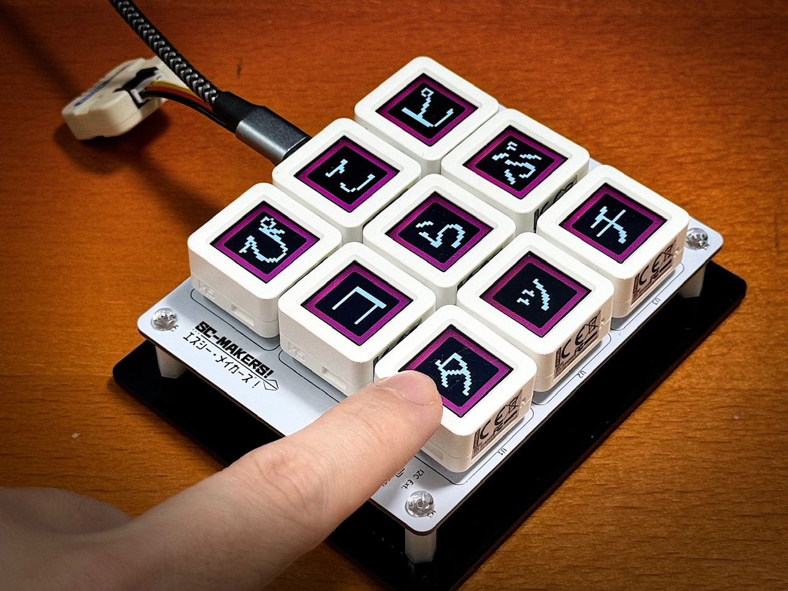
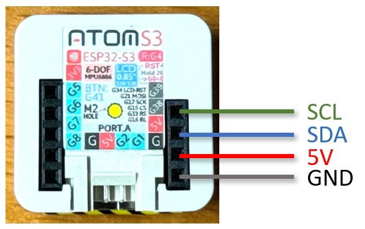
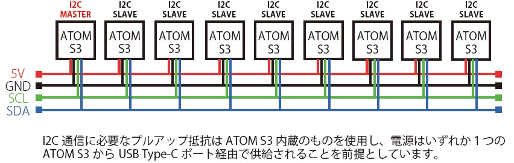
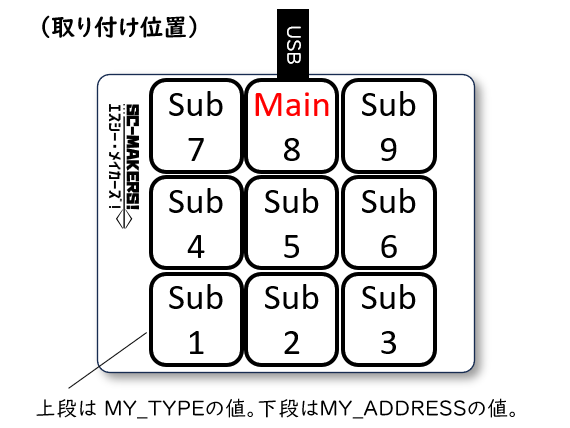

# Piko Piko Love Touch Mini (2023) for ATOM S3

ぴこピコ☆らぶタッチMini（2023） for ATOM S3



## 概要

「[ぴこピコ☆らぶタッチMini（2023）](https://makers.scnet.co.jp/portfolio/ppltmini2023/)」（以下、本作品）は２人で遊べる相性診断ゲーム機「ぴこピコ☆らぶタッチ」の小型バージョンです。[ATOM S3](https://docs.m5stack.com/en/core/AtomS3)を９個使って製作されました。

このリポジトリには本作品を再現するために必要な専用ソフトウェア（以下、本ソフトウェア）のソースコードが格納されています。

## 主な機能

I2C通信機能を使って９個のATOM S3を連係させ、「ぴこピコ☆らぶタッチ」でおなじみの相性診断ゲームで遊べるようにします。

I2C Masterとして動作させるATOM S3に[ブザーUnit](https://docs.m5stack.com/en/unit/buzzer)を接続すると簡易な効果音も再生されます。

### 前提条件

９個のATOM S3が背面ポートを通じてI2C通信できるよう接続されていること。

「ぴこピコ☆らぶタッチMini製作キット」を使うのがおすすめですが、キットが手元になくとも配線さえすればI2C通信できる状態になります。





## 使い方

### インストール

Arduino IDEを使って９個のATOM S3に1つずつ本ソフトウェアを書き込みます。

このとき各ATOM S3を１個ずつ異なるアドレス、通信モードで動作させるために、ソースコードの一部を書き換える必要があることに注意してください。

具体的には次の２つの値を変更してからソースコードをビルドし、ATOM S3へ書き込む作業を計９回繰り返します。

#### 変更する必要があるコード（PPLTmini4Atom.ino）

```
const PPLTAddress MY_ADDRESS = 8;  // 自アドレス(1-9)。I2Cアドレスとしても使用する。
const PPLTConnectType MY_TYPE = PPLTConnectType::Main; // 通信モード(Main or Sub)
```

##### MY_ADDRESS = 8の場合

MY_ADDRESS = 8に指定するATOM S3のみ MY_TYPE = PPLTConnectType::Main に指定します。

```
const PPLTAddress MY_ADDRESS = 8;
const PPLTConnectType MY_TYPE = PPLTConnectType::Main; // 8 only
```

##### MY_ADDRESS = 1～7、9の場合

その他の（MY_ADDRESS = 1-7および9に指定する）ATOM S3は MY_TYPE = PPLTConnectType::Sub に指定します。

```
const PPLTAddress MY_ADDRESS = 1; // 1...7 and 9
const PPLTConnectType MY_TYPE = PPLTConnectType::Sub; // others
```

### ATOM S3の配置

専用ソフトウェアを書き込んだATOM S3は次のように並べて使用します。



「ぴこピコ☆らぶタッチMini製作キット」を用いる場合は、ピンヘッダをはんだ付けした後のプリント基板へ同様の並び方でATOM S3を取り付けます。（基板に印字されたSC-MAKERS!ロゴの位置も参考にしてください）

## ソフトウェア改造のヒント

- 本ソフトウェアは主にアプリケーションクラス、通信クラス、描画クラスの３種類のクラスの組合せで作られています。まずPPLTmini4Atom.inoを参照してください。
- ディスプレイ表示をアレンジするには描画クラス（PPLTViewという名前で始まるクラス）の中身を書き換えてみてください。
- ゲームやアプリケーションの挙動をアレンジするにはアプリケーションクラス（PPLTAppという名前で始まるクラス）の中身を書き換えてみてください。

# ヘルプ

「ぴこピコ☆らぶタッチMini（2023）」および「ぴこピコ☆らぶタッチMini製作キット」については、SC-MAKERS!ウェブサイトの作品紹介ページをご覧ください。

- [ぴこピコ☆らぶタッチMini（2023）](https://makers.scnet.co.jp/portfolio/ppltmini2023/)※製作キットの情報も含みます

## Author

[SC-MAKERS!](https://makers.scnet.co.jp/) Team

## License and Credits

This software uses the following libraries below:

| Software | License | Copyright |
| --- | --- | --- |
| [Arduino](https://github.com/esp8266/Arduino) | [LGPL-2.1 license](https://github.com/esp8266/Arduino/blob/master/LICENSE) | Copyright (C) 1991, 1999 Free Software Foundation, Inc. |
| [arduino-esp32](https://github.com/espressif/arduino-esp32) | [LGPL-2.1 license](https://github.com/espressif/arduino-esp32/blob/master/LICENSE.md) | Copyright (C) 1991, 1999 Free Software Foundation, Inc. |
| [M5Unified](https://github.com/m5stack/M5Unified) | [MIT license](https://github.com/m5stack/M5Unified/blob/master/LICENSE) | Copyright (c) 2021 M5Stack |

## Copyright

(c)2023 Software Control Corporation

This software is released under the MIT License.
See LICENSE.
